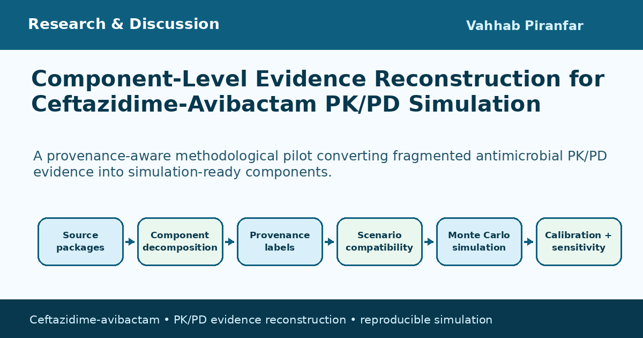

::: {.paper-cover}
{fig-alt="Workflow banner: Component-Level Evidence Reconstruction for Ceftazidime-Avibactam PK/PD Simulation"}
:::

Published PK/PD evidence can be reused more transparently when provenance, missingness, transformation pathways, and scenario compatibility are preserved.

## Project summary

This project presents a methodological pilot for converting fragmented antimicrobial pharmacokinetic/pharmacodynamic (PK/PD) evidence into simulation-ready components. The pilot target was ceftazidime-avibactam, a beta-lactam/beta-lactamase inhibitor combination used in difficult-to-treat Gram-negative infections.

The central problem is that published antimicrobial PK/PD evidence is often scientifically valuable but not immediately reusable. A paper may report clearance equations but not MIC weights, another may report trough concentrations but not a complete simulation model, and another may provide target-site or in vitro pharmacodynamic information that is useful but not directly compatible with the clinical scenario of interest.

Rather than treating each publication as either fully included or excluded, the project used a component-level evidence-composite approach. Each source was decomposed into reusable scientific components such as clearance relationships, interindividual variability, protein binding or unbound fraction, PK/PD target definitions, MIC distributions, calibration anchors, and uncertainty inputs. Each component was then assigned a provenance label, a transformation label, and a review state. This made it possible to distinguish directly reported values from inherited, donor-derived, model-inferred, user-specified, or scenario-generated values. Missing data were not silently filled; they were retained as explicit evidence gaps unless a compatible donor component was used with clear labeling.

## Why the workflow was needed

The project was motivated by a practical limitation in pharmacometric evidence reuse. Automated extraction can identify numerical values, but it cannot decide whether a value is directly observed, inherited from a prior model, transformed from another parameter, compatible with a target population, or appropriate for a new simulation scenario.

This problem is especially important for ceftazidime-avibactam because the two components cannot be collapsed into a single exposure metric. Ceftazidime provides the antibacterial beta-lactam exposure, whereas avibactam protects ceftazidime from susceptible beta-lactamases. A regimen may appear adequate for ceftazidime while avibactam exposure remains limiting. For that reason, the workflow modeled ceftazidime and avibactam separately and evaluated them jointly.

The evidence base included six source packages spanning critically ill continuous-infusion PK/PD modeling, continuous venovenous hemodiafiltration, extracorporeal membrane oxygenation, healthy-volunteer plasma and cerebrospinal fluid pharmacokinetics, MIC surveillance, and in vitro inoculum-effect PK/PD. These sources were scientifically complementary but not interchangeable. The workflow therefore assessed scenario compatibility at the component level. CVVHDF, ECMO, CSF, and in vitro evidence were retained as anchors or donor evidence where appropriate, but they were not silently pooled into the primary ICU non-RRT simulation scenario.

## What was simulated

The primary scenario was critically ill adults without renal replacement therapy receiving continuous-infusion ceftazidime-avibactam. The Monte Carlo simulation included 100,000 virtual subjects distributed across five European Kidney Function Consortium renal-function classes. The workflow reconstructed component-specific clearance, applied correlated lognormal interindividual variability, and calculated steady-state free concentrations for each component. Ceftazidime target attainment was evaluated using a free steady-state concentration to MIC ratio of at least 4, while avibactam target attainment was evaluated relative to a fixed 4 mg/L threshold. Joint target attainment required both targets to be achieved at the same time.

The simulation outputs included probability of target attainment, MIC-weighted cumulative fraction of response, toxicity-oriented exposure screening, calibration against published component-level benchmarks, convergence analysis, multi-seed reproducibility, global sensitivity analysis, and probabilistic sensitivity analysis. The calibration framework included 72 comparison rows, of which 69 passed predefined criteria, 3 required targeted review, and none failed. The convergence analysis showed that 50,000 virtual subjects were stable for summary-level interpretation, while 100,000 subjects were retained for final outputs.

## Main methodological findings

The most important result was not a dosing recommendation. The main result was methodological: incomplete antimicrobial pharmacometric publications can be converted into reproducible, simulation-ready evidence components when provenance, missingness, transformation pathways, and scenario compatibility are explicitly preserved.

The project also showed that point estimates alone are not enough for interpreting ceftazidime-avibactam performance. Under probabilistic stress testing, no regimen-distribution pair met the predefined criterion for full robustness. Seven pairs were conditionally robust and thirteen were fragile, emphasizing the importance of reporting uncertainty alongside baseline PTA or CFR values.

A second major finding was that avibactam-related assumptions were dominant drivers of joint target attainment uncertainty. Avibactam clearance, avibactam interindividual variability, and avibactam unbound fraction ranked above most ceftazidime-related inputs in the sensitivity analysis. This supports the decision to preserve ceftazidime and avibactam as separate components throughout the workflow. It also illustrates why a combination antibiotic should not be simplified into one aggregate exposure measure when the pharmacology of each component affects the final joint PK/PD interpretation.

## Boundaries and interpretation

This project should be interpreted as a reproducibility and evidence-reconstruction framework, not as a clinical dosing guideline. It did not fit a new population PK model, did not enroll patients, did not access identifiable patient data, and was not designed as a systematic review or meta-analysis. The outputs are conditional on the selected source packages, scenario definitions, MIC distributions, target policies, and toxicity-screening assumptions. Clinical dosing decisions require patient-specific assessment, local microbiology, therapeutic drug monitoring where available, institutional guidance, and prospective validation.

The broader value of the project is that it provides a practical framework for secondary use of published antimicrobial pharmacometric evidence. Many antimicrobial PK/PD publications are incomplete from the perspective of simulation reuse, but they still contain valuable components. By preserving provenance and missingness rather than hiding them, the workflow makes evidence reconstruction more transparent, auditable, and reproducible. The same approach could be extended to other antimicrobial combinations, extracorporeal-support settings, or resistance-suppression questions where published evidence is fragmented across multiple study designs.

## Closing

In summary, this project demonstrates a provenance-aware evidence-composite workflow for transforming fragmented ceftazidime-avibactam PK/PD publications into transparent, simulation-ready components. The pilot connects antimicrobial pharmacology, evidence curation, reproducible computation, and uncertainty analysis. Its main contribution is not a specific regimen choice, but a structured way to make incomplete pharmacometric evidence reusable without losing scientific context.

::: {.callout-note}
### Key highlights

- 100,000 virtual subjects across five EKFC renal-function classes
- Ceftazidime and avibactam modeled separately and evaluated jointly
- 69 of 72 calibration comparison rows met predefined pass criteria
- Avibactam clearance, variability, and unbound fraction were dominant uncertainty drivers
- The framework is a methodological proof of concept, not a clinical dosing recommendation
:::

```{=html}
<script>
document.addEventListener('DOMContentLoaded', function() {
  let modal = document.getElementById('lightbox-modal');
  if (!modal) {
    modal = document.createElement('div');
    modal.id = 'lightbox-modal';
    modal.className = 'lightbox-modal';
    modal.innerHTML = `
      <div class="lightbox-content">
        <button class="lightbox-close" aria-label="Close image">&times;</button>
        
      </div>
    `;
    document.body.appendChild(modal);
  }

  const lightboxModal = document.getElementById('lightbox-modal');
  const lightboxImg = document.getElementById('lightbox-img');
  const closeBtn = document.querySelector('.lightbox-close');

  const paperImages = document.querySelectorAll('.paper-cover img');
  paperImages.forEach(img => {
    img.addEventListener('click', function() {
      lightboxImg.src = this.src;
      lightboxImg.alt = this.alt;
      lightboxModal.classList.add('active');
      document.body.style.overflow = 'hidden';
    });
  });

  function closeLightbox() {
    lightboxModal.classList.remove('active');
    document.body.style.overflow = 'auto';
  }

  closeBtn.addEventListener('click', closeLightbox);

  lightboxModal.addEventListener('click', function(e) {
    if (e.target === this) {
      closeLightbox();
    }
  });

  document.addEventListener('keydown', function(e) {
    if (e.key === 'Escape' && lightboxModal.classList.contains('active')) {
      closeLightbox();
    }
  });
});
</script>
```
